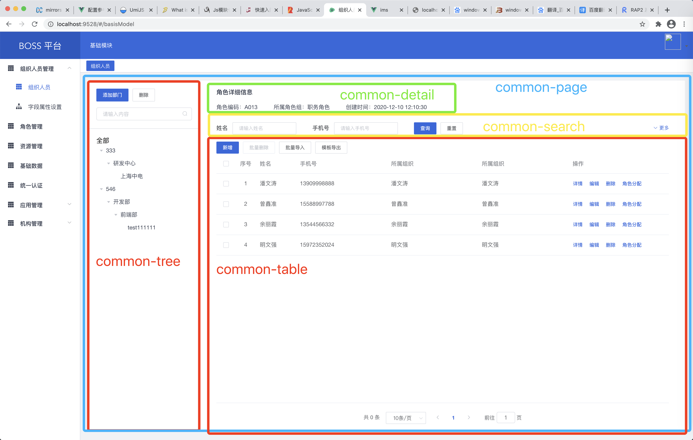

# ims

## Project setup
```
yarn install
```

### Compiles and hot-reloads for development
```
yarn serve
```

### Compiles and minifies for production
```
yarn build
```

### Lints and fixes files
```
yarn lint
```

### 项目三方库
- element-ui ui组件
- lodash js工具库
- axios http请求
- iconfont 图标库
- velocity 动画库
- deploy-cli-service 自动部署

> 项目中有使用到内部库，建议切换npm来源，使用`nrm`或者修改`npm`的`registry`

### nrm
1、安装
```bash
# 全局安装
npm i -g nrm
```

2、添加内部仓库地址
```bash
nrm add zd http://192.168.4.43:8081/repository/zd_npm_public/
# 查看仓库
nrm ls
```

3、切换仓库
```bash
nrm use zd
```

4、使用
```
npm install xxx
```


### 修改npm的register(建议)
```bash 
npm config set registry http://192.168.4.43:8081/repository/zd_npm_public/
```

### 登录
使用saas平台统一登录，`http://192.168.4.72/test/`


### 组件
`src/components/common`目录下的组件自动注册到全局,非全局组件放置`common`同级目录
#### 全局组件说明（`/src/components/common`）




 
### Customize configuration
See [Configuration Reference](https://cli.vuejs.org/config/).
