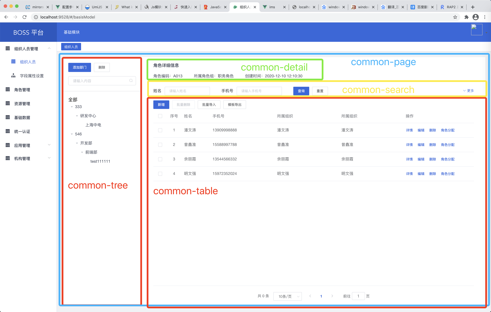

# ims

## Project setup
```
yarn install
```

### Compiles and hot-reloads for development
```
yarn serve
```

### Compiles and minifies for production
```
yarn build
```

### Lints and fixes files
```
yarn lint
```

### 项目三方库
- element-ui ui组件
- lodash js工具库
- axios http请求
- iconfont 图标库

### 登录
使用saas平台统一登录，`http://192.168.4.72/test/`


### 组件
`src/components/common`目录下的组件自动注册到全局,非全局组件放置`common`同级目录
#### 全局组件说明（`/src/components/common`）




 
### Customize configuration
See [Configuration Reference](https://cli.vuejs.org/config/).
